## Paciente

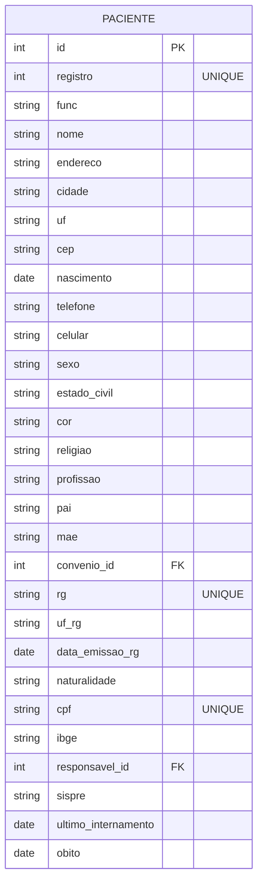

---

## Médico

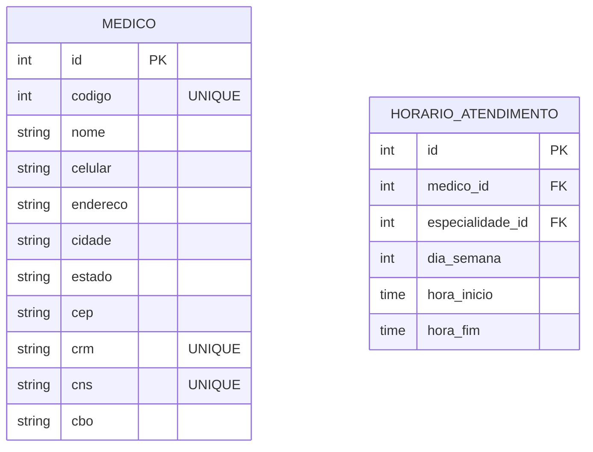

---

## Setor

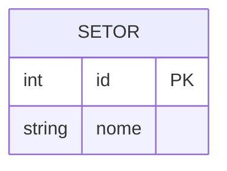

---

## Quarto

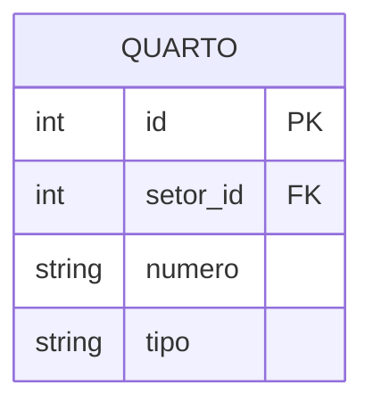

---

## Leito

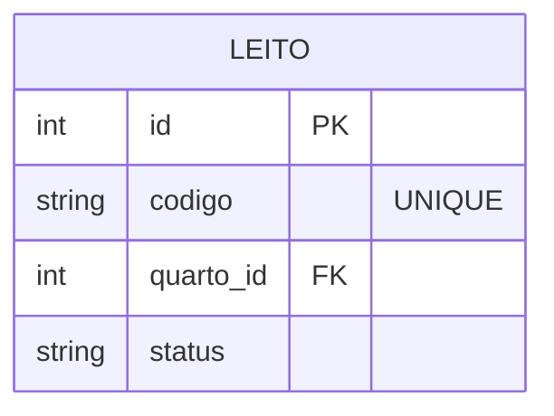

---

## Especialidade

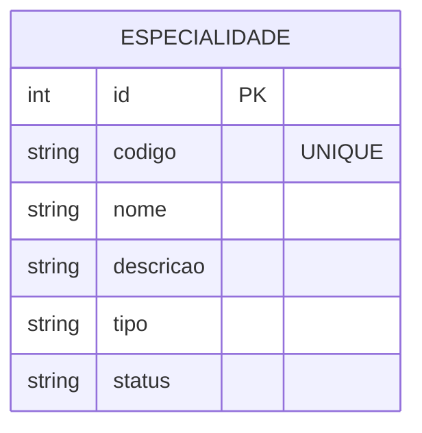
---

## Internamento

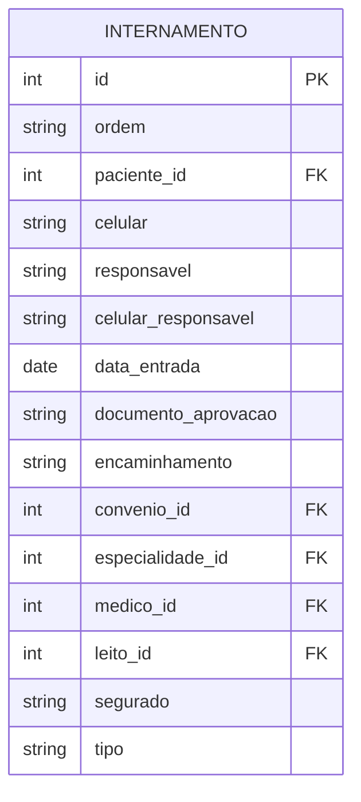

---

## Convênio

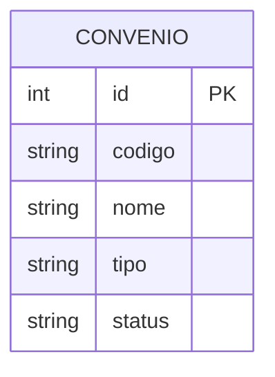

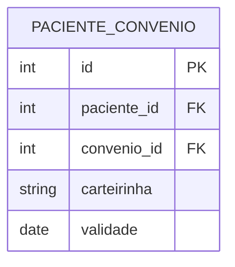

---

## Estado Geral

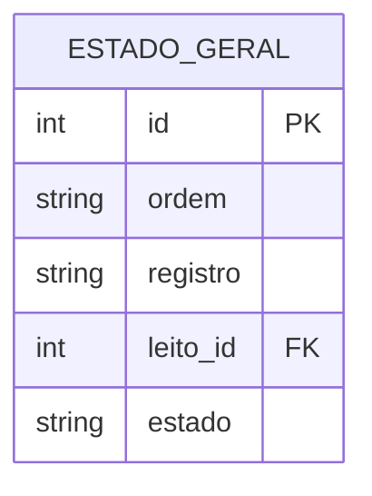

---

## Alta

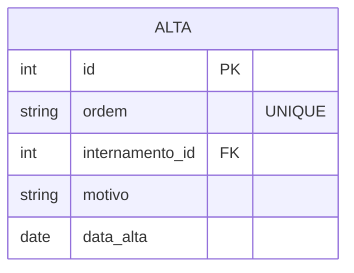

---

## Responsável

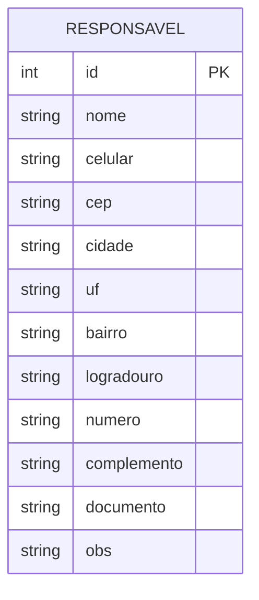

---

## Atendimento Clínico

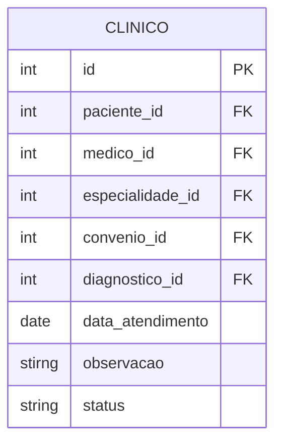

---

## Emergência

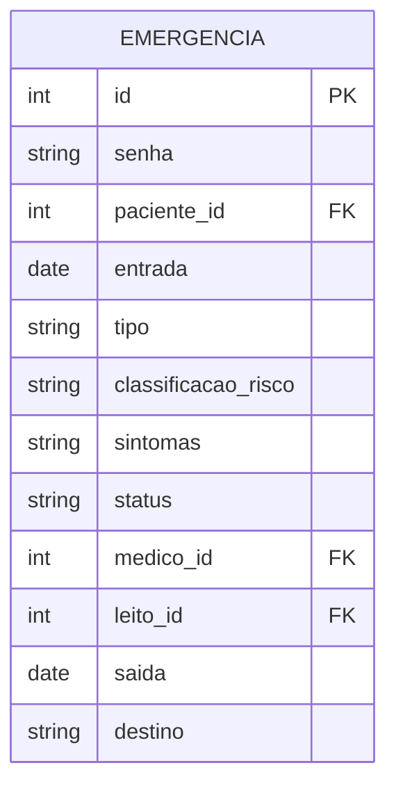

---

## Diagnóstico

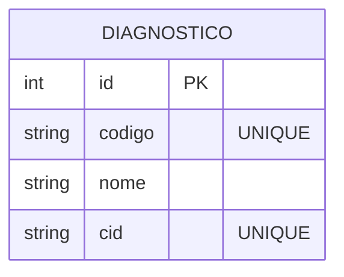

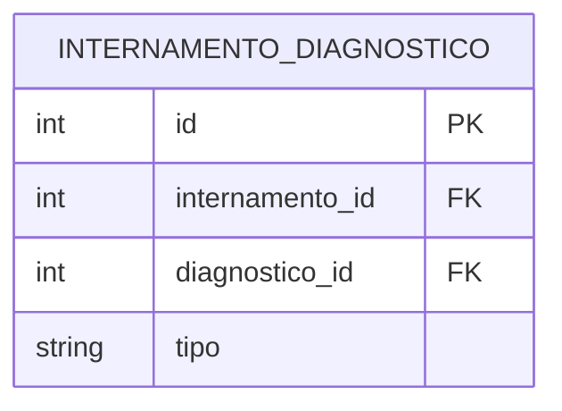

---

## Procedimento

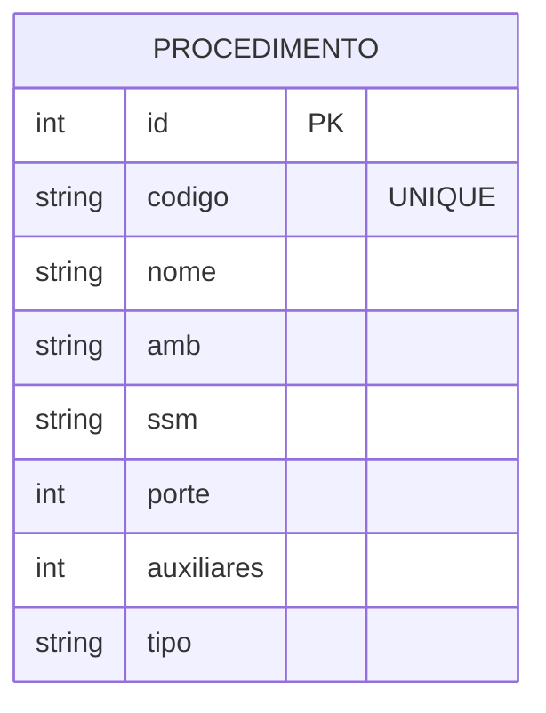

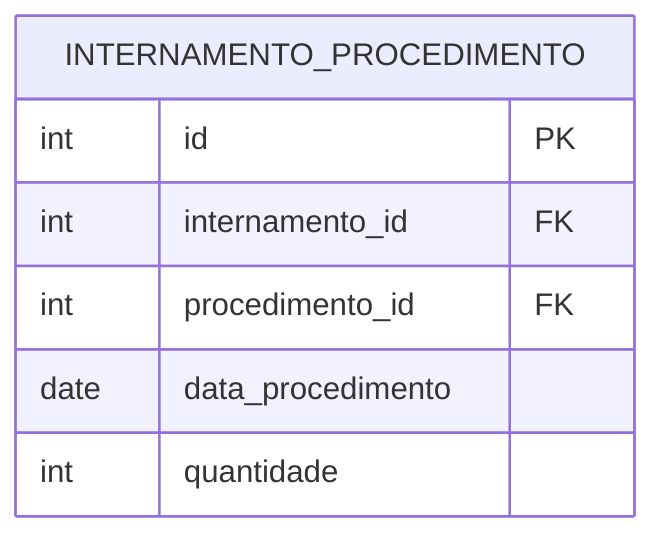

---
