## Paciente
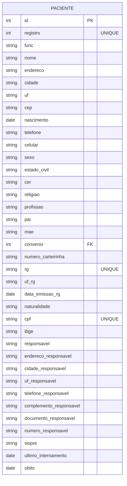

---

## Médico
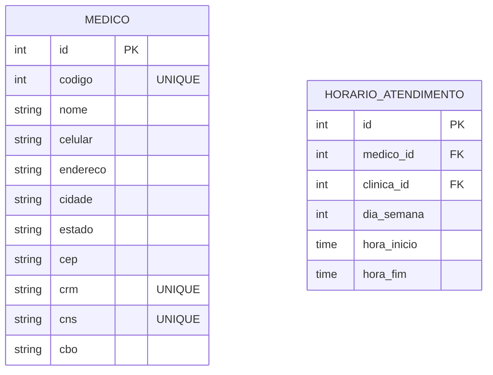

---

## Setor
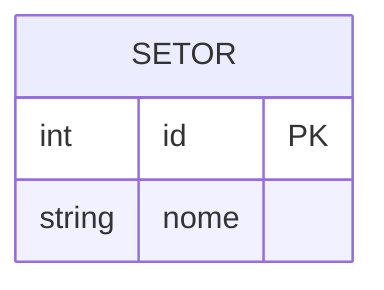

---

## Quarto
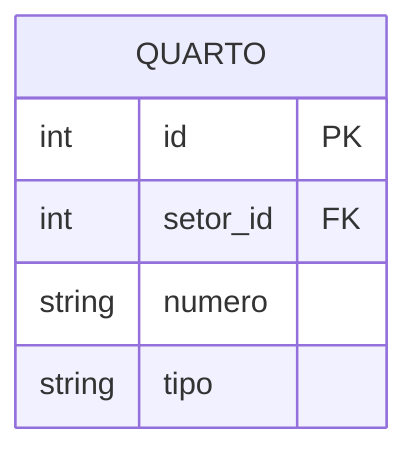

---

## Leito
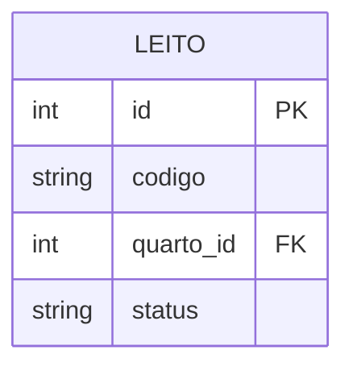

---

## Especialidade
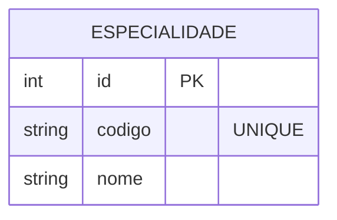

---

## Diagnóstico
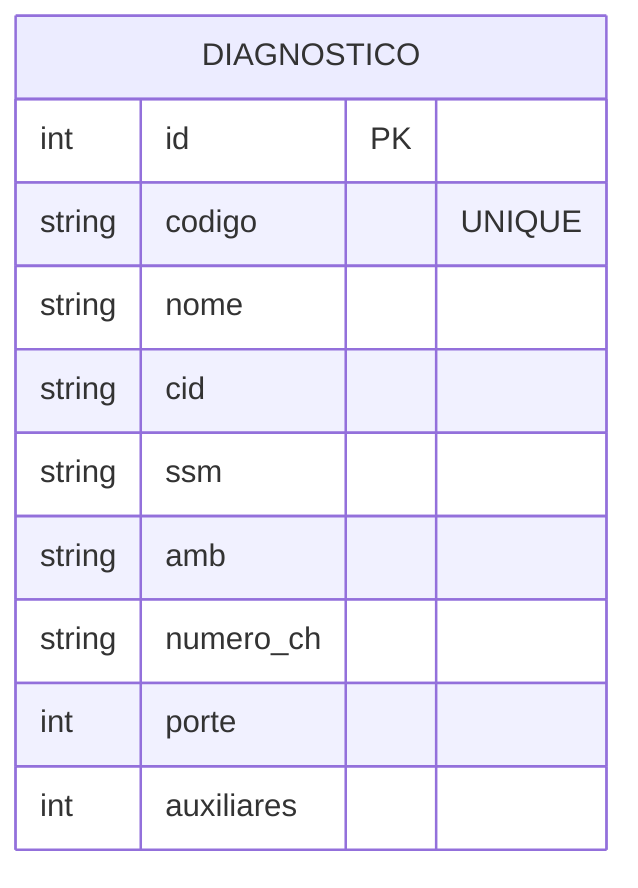

---

## Internamento
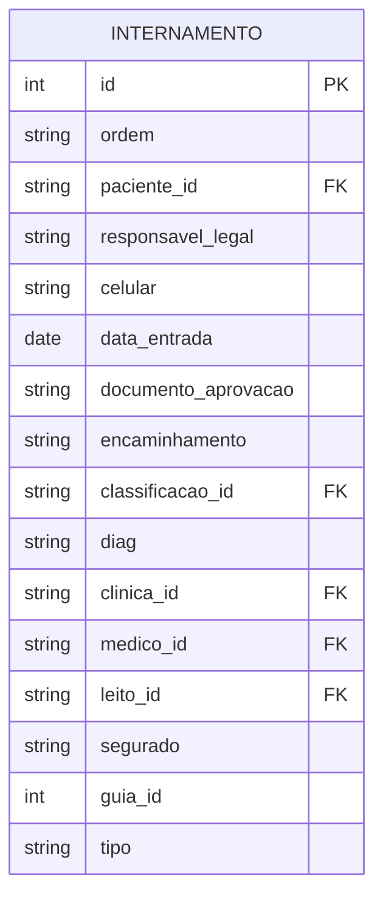

---

## Convênio
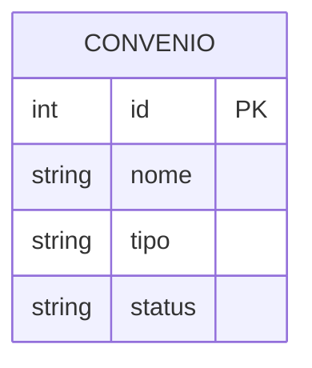

---

## Estado Geral
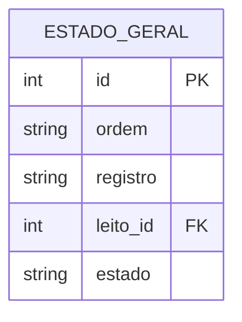

---

## Alta
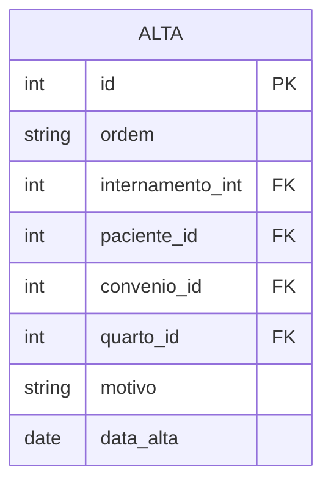

---

## 