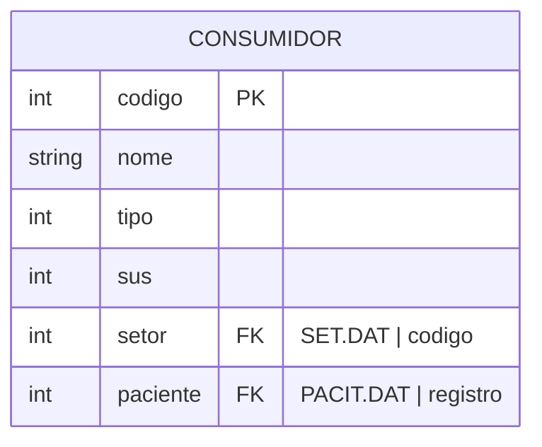

#entidade
## Arquivos:
- CONSU.DAT
- SET.DAT ([[Setor (SET.DAT)]])
- PACIT.DAT ([[Paciente (PACIT.DAT, PACIT2.DAT, PACIT3.DAT)]])

---

## Entidade:

### Valores predefinidos:
#### tipo
- 1 = Enfermaria
- 2 = Apartamento
- 3 = Especial E.
- 4 = Especial A.
- 5 = Diversos
#### Sus
- 0 = SUS
- 1 = Normal
