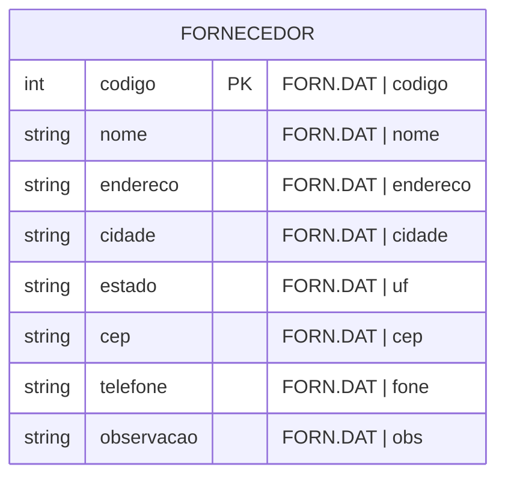

#entidade
## Arquivos:
- FORN.DAT

---

## Entidade:

```mermaid
erDiagram
FORNECEDOR {
	int codigo PK "FORN.DAT | codigo"
	string nome "FORN.DAT | nome"
	string endereco "FORN.DAT | endereco"
	string cidade "FORN.DAT | cidade"
	string estado "FORN.DAT | uf"
	string cep "FORN.DAT | cep"
	string telefone "FORN.DAT | fone"
	string observacao "FORN.DAT | obs"
}
```
