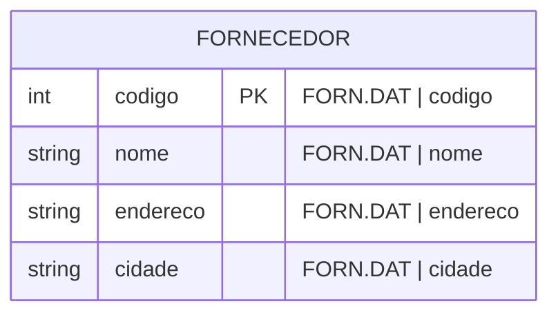

#entidade
## Entidade:

```mermaid
erDiagram
FORNECEDOR {
	int codigo PK "FORN.DAT | codigo"
	string nome "FORN.DAT | nome"
	string endereco "FORN.DAT | endereco"
	string cidade "FORN.DAT | cidade"
}
```
