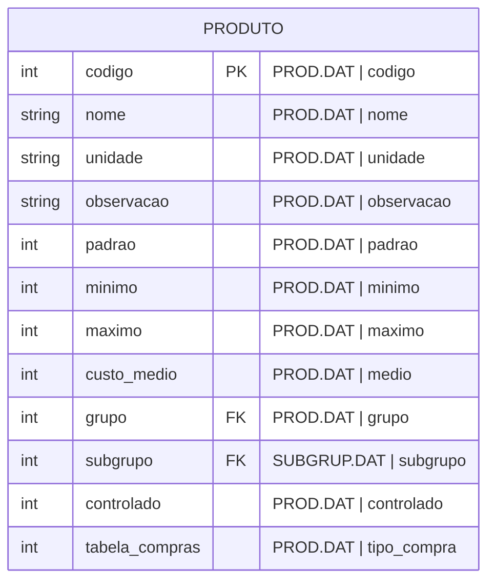

#entidade
## Arquivos:
- PROD.DAT
- GRUP.DAT ([[Grupo (GRUP.DAT)]])
- SUBGRUP.DAT ([[Subgrupo (SUBGRUP.DAT)]])

---

## Entidade:

### Valores predefinidos
#### controlado
- 0 = Nao
- 1 = P. 27
- 2 = P. 28 A
- 3 = P. 28 B
- 4 = Antimi.
- 5 = Outros
