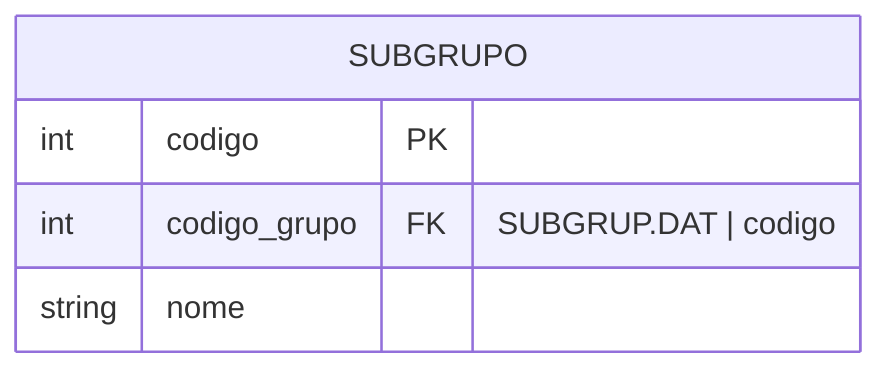

#entidade
## Arquivos:
- GRUP.DAT
- SUBGRUP.DAT [[Subgrupo (SUBGRUP.DAT)]]

---

## Entidade:

```mermaid
erDiagram
SUBGRUPO {
	int codigo PK
	int codigo_grupo FK "SUBGRUP.DAT | codigo"
	string nome
}
```
