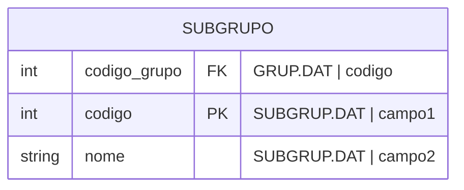

#entidade
## Arquivos:
- SUBGRUP.DAT
- GRUP.DAT ([[Grupo (GRUP.DAT)]])

---

## Entidade:

---

## Obs:
- 2 primeiros dígitos de `campo1` se referem ao código do grupo e os 2 últimos se referem ao código do subgrupo
