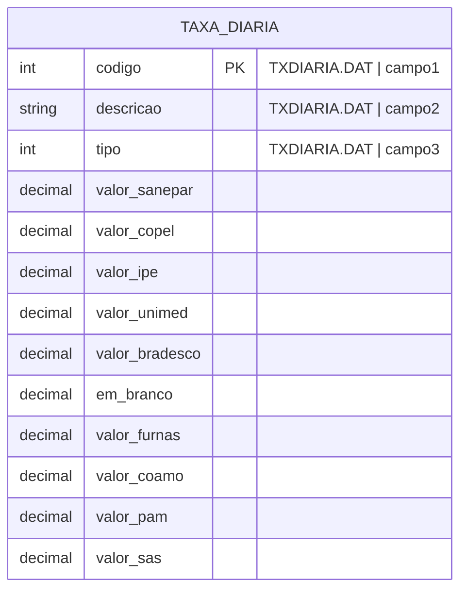

#entidade
## Arquivos:
- TXDIARIA.DAT
- NDIARIA.DAT

---

## Entidade:

```mermaid
erDiagram

TAXA_DIARIA {
	int codigo PK "TXDIARIA.DAT | campo1"
	string descricao "TXDIARIA.DAT | campo2"
	int tipo "TXDIARIA.DAT | campo3"
	decimal valor_sanepar
	decimal valor_copel
	decimal valor_ipe
	decimal valor_unimed
	decimal valor_bradesco
	decimal em_branco
	decimal valor_furnas
	decimal valor_coamo
	decimal valor_pam
	decimal valor_sas
}
```

### Valores predefinidos:
#### tipo
- 0 = Diária
- 1 = Taxa
