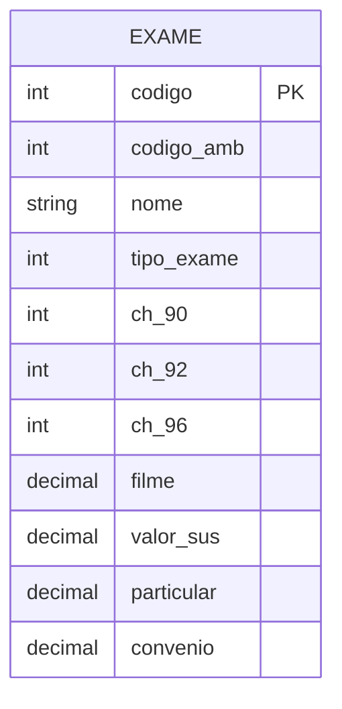

#entidade
## Arquivos
- EXAME.DAT

---

## Entidade:

```mermaid
erDiagram
EXAME {
	int codigo PK
	int codigo_amb
	string nome
	int tipo_exame
	int ch_90
	int ch_92
	int ch_96
	decimal filme
	decimal valor_sus
	decimal particular
	decimal convenio
}
```

O sistema calcula sozinho os valores "particular" e "convênio"
