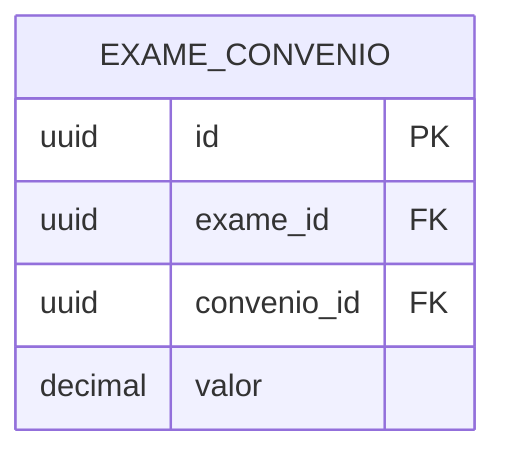

#entidade 
## Entidade:

```mermaid
erDiagram
EXAME_CONVENIO {
	uuid id PK
	uuid exame_id FK
	uuid convenio_id FK
	decimal valor
}
```

---

## Entidades que se relaciona:
- [[Exame]]
- [[Convênio]]
- [[Item da Conta]]