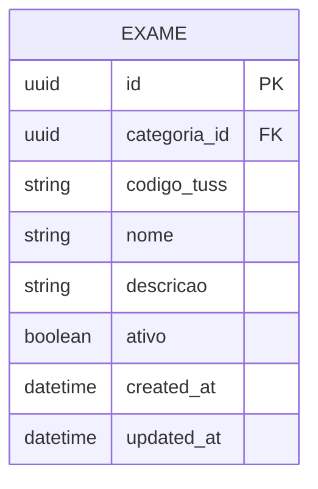

#entidade 
## Entidade:

```mermaid
erDiagram
EXAME {
	uuid id PK
	uuid categoria_id FK
	string codigo_tuss
	string nome
	string descricao
	boolean ativo
	datetime created_at
	datetime updated_at
}
```

---

## Entidades que se relaciona:
- [[Exames por Convênio]]
- [[Categorias de Exame]]