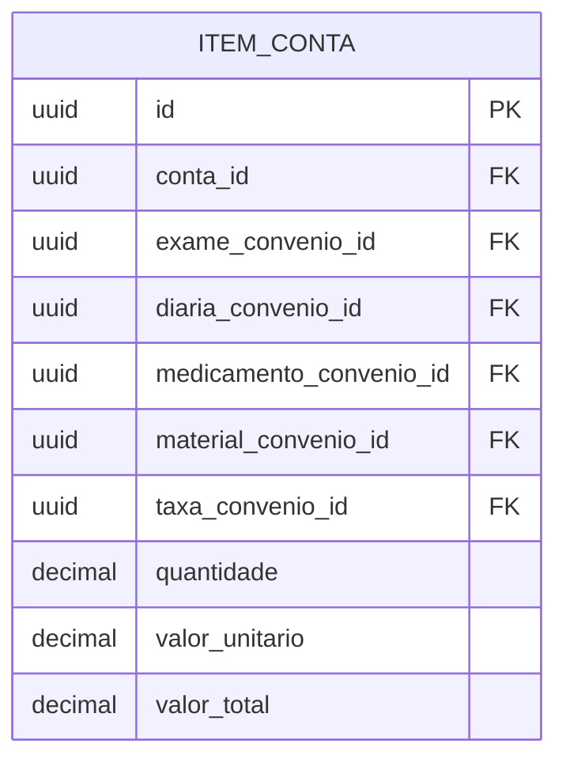

#entidade 
## Entidade:

%%
Quais tipos de item tem em uma conta hospitalar?
- [x] Exames
- [x] Diárias
- [x] Medicamentos
- [ ] Honorários
- [x] Raio-x (já se encaixa em exames no geral)
- [x] Taxas
- [x] Materiais
- [ ] Diversos
Marcar quais entidades já existem e podem ser colocadas na conta hospitalar
%%

---

## Entidades que se relaciona:
- [[Conta]]
- [[Exame por Convênio]]
- [[Diária por Convênio]]
- [[Material por Convênio]]
- [[Medicamento por Convênio]]