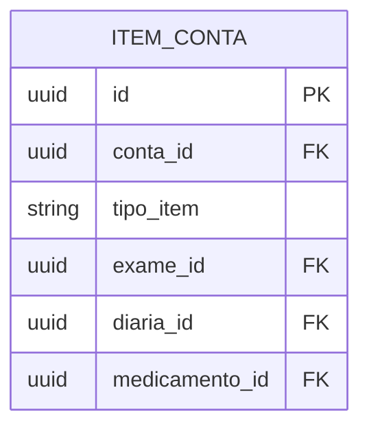

#entidade 
## Entidade:

%%
Quais tipos de item tem em uma conta hospitalar?
- [x] Exames
- [ ] Diárias
- [ ] Medicamentos
- [ ] Honorários
- [ ] Raio-x
- [ ] Taxas
- [ ] Materiais
- [ ] Diversos
Marcar quais entidades já existem e podem ser colocadas na conta hospitalar

No sistema legado os exames são divididos por tipo.
- 0- Raio-x
- 1- 
%%

---

## Entidades que se relaciona:
- [[Conta]]
- [[Exames por Convênio]]