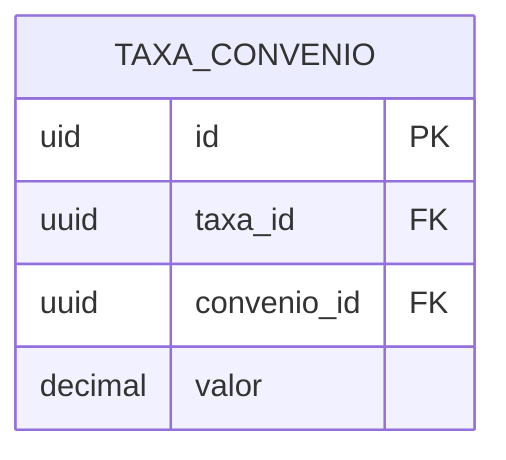

#entidade 
## Entidade:

```mermaid
erDiagram
TAXA_CONVENIO {
	uid id PK
	uuid taxa_id FK
	uuid convenio_id FK
	decimal valor
}
```

---

## Entidades que se relaciona:
- [[Taxa]]
- [[Convênio]]
- [[Item da Conta]]