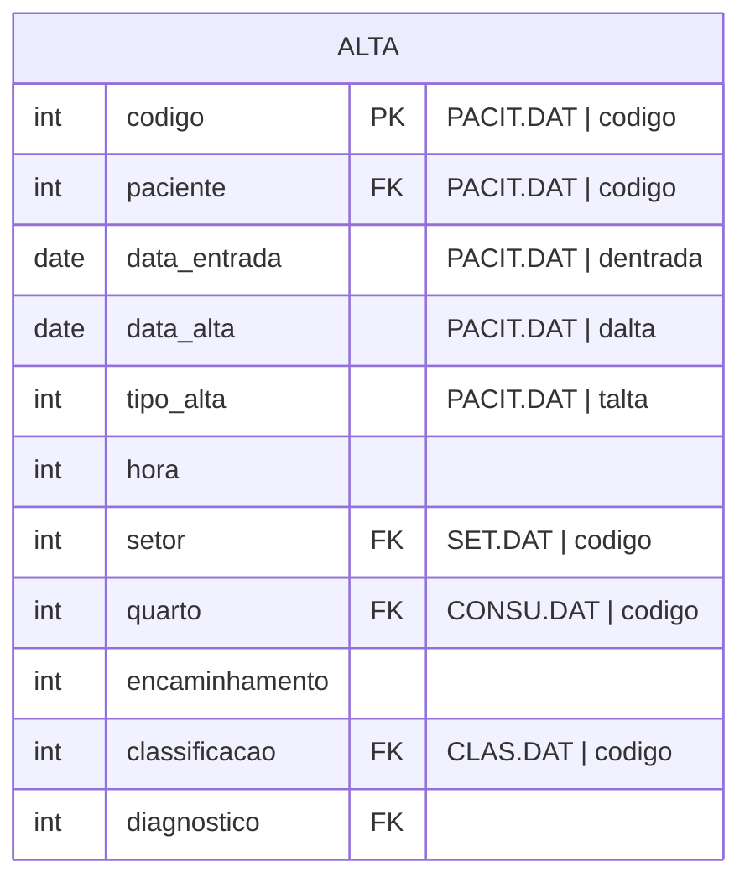

#entidade
## Arquivos:
- ALTA.DAT
- INTER.DAT ([[Internação (INTER.DAT)]])
- PACIT.DAT ([[Paciente (PACIT.DAT, PACIT2.DAT, PACIT3.DAT)]])
- CONSU.DAT ([[Consumidor (CONSU.DAT)]])
- CLAS.DAT ([[Classificação (CLAS.DAT)]])
- SET.DAT ([[Setor (SET.DAT)]])

---

## Entidade:

 