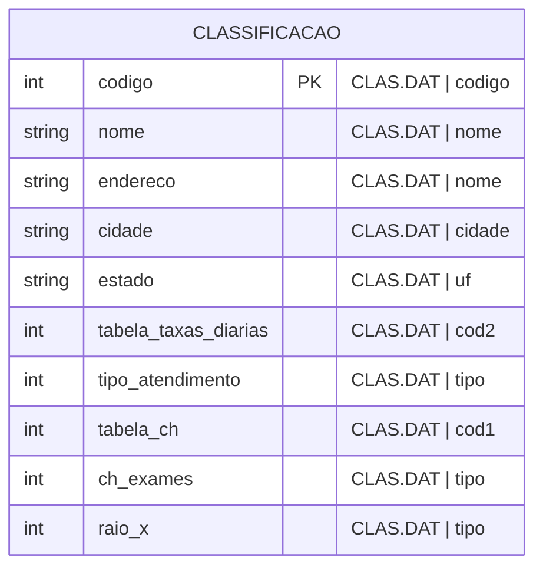

#entidade
## Entidade:

```mermaid
erDiagram
CLASSIFICACAO {
	int codigo PK "CLAS.DAT | codigo"
	string nome "CLAS.DAT | nome"
	string endereco "CLAS.DAT | nome"
	string cidade "CLAS.DAT | cidade"
	string estado "CLAS.DAT | uf"
	int tabela_taxas_diarias "CLAS.DAT | cod2"
	int tipo_atendimento "CLAS.DAT | tipo"
	int tabela_ch "CLAS.DAT | cod1"
	int ch_exames "CLAS.DAT | tipo"
	int raio_x "CLAS.DAT | tipo"
}
```

### Obs:
- `nome` e `endereco` estão juntos em `nome`
- `tipo_atendimento`, `ch_exames` e `raio_x` estão em `CLAS.DAT/tipo`: `tipo_atendimento/raio_x/ch_exames`
