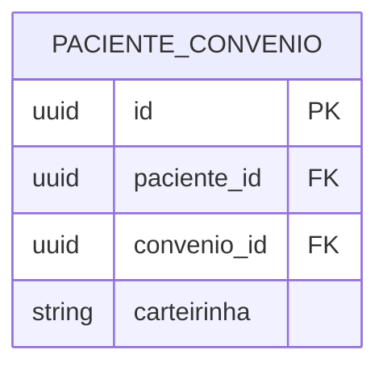

#entidade
## Entidade:

```mermaid
erDiagram
PACIENTE_CONVENIO {
	uuid id PK
	uuid paciente_id FK
	uuid convenio_id FK
	string carteirinha
}
```

---

## Entidades que se relaciona:
- [[Paciente]]
- [[Convênio]]