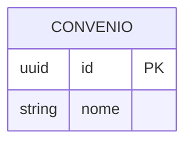

#entidade
## Entidade:

```mermaid
erDiagram
CONVENIO {
	uuid id PK
	string nome
}
```

---

## Entidades que se relaciona:
- [[Convênio do Paciente]]
- [[Convênio da Internação]]

// Falta coisa ainda