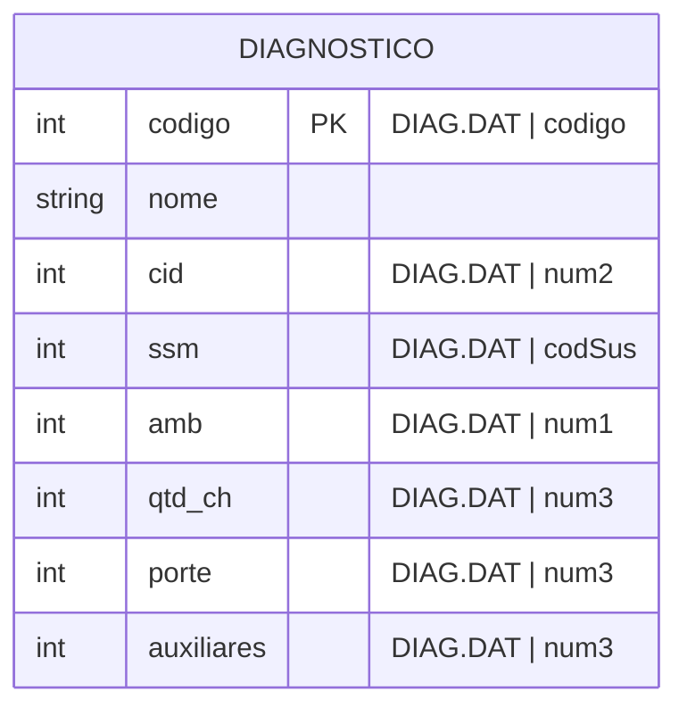

#entidade
## Arquivos:
- DIAG.DAT

---

## Entidade:

```mermaid
erDiagram
DIAGNOSTICO {
	int codigo PK "DIAG.DAT | codigo"
	string nome ""
	int cid "DIAG.DAT | num2"
	int ssm "DIAG.DAT | codSus"
	int amb "DIAG.DAT | num1"
	int qtd_ch "DIAG.DAT | num3"
	int porte "DIAG.DAT | num3"
	int auxiliares "DIAG.DAT | num3"
}
```

### Obs:
- Os 4 primeiros dígitos