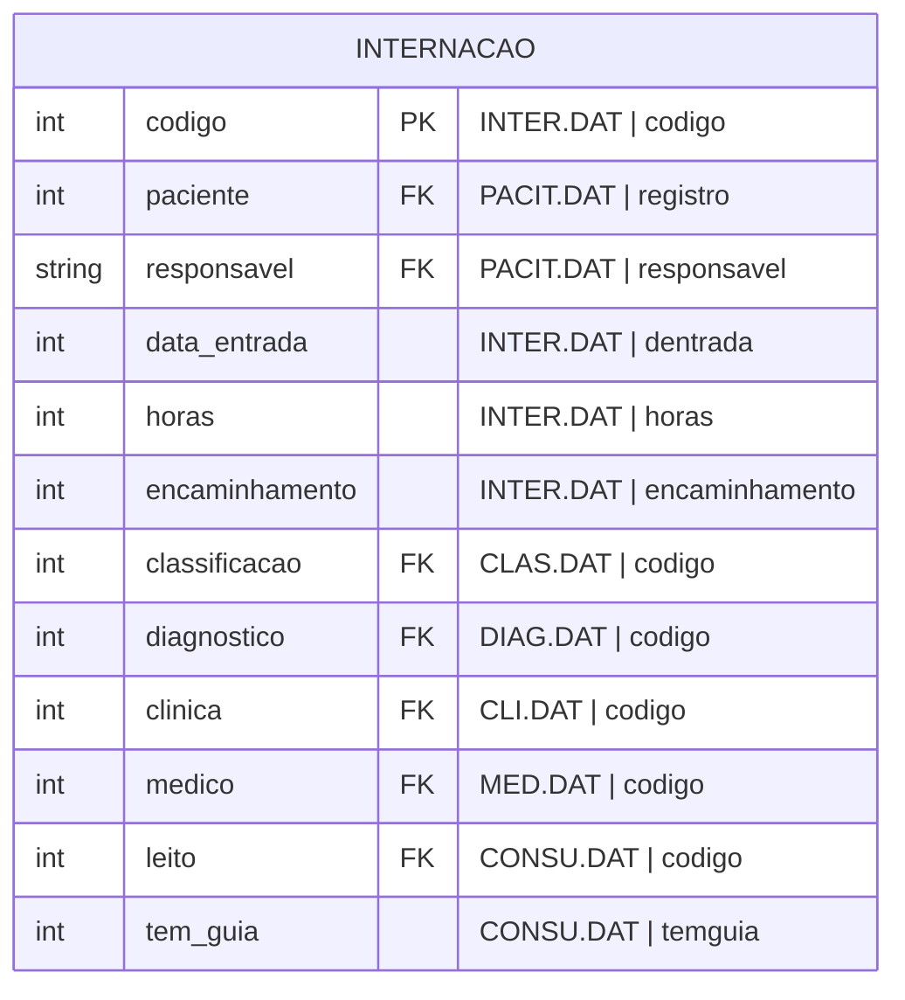

#entidade
## Arquivos:
- INTER.DAT
- INTER5.DAT
- PACIT.DAT ([[Paciente (PACIT.DAT, PACIT2.DAT, PACIT3.DAT)]])
- PACIT2.DAT ([[Paciente (PACIT.DAT, PACIT2.DAT, PACIT3.DAT)]])
- PACIT3.DAT ([[Paciente (PACIT.DAT, PACIT2.DAT, PACIT3.DAT)]])
- CLAS.DAT ([[Classificação (CLAS.DAT)]])
- DIAG.DAT ([[Diagnóstico (DIAG.DAT)]])
- MED.DAT ([[Médico (MED.DAT)]])
- CONSU.DAT ([[Consumidor (CONSU.DAT)]])
- CLI.DAT ([[Especialidade (CLI.DAT)]])
- SET.DAT ([[Setor (SET.DAT)]])
- ALTA.DAT ([[Alta (ALTA.DAT)]])

---

## Entidade:

### Valores predefinidos:
#### encaminhamento
- 0 = Cons.
- 1 = H.M.I.
- 2 = P. Saude
- 3 = P. Soc.
- 4 = Prefei.
- 5 = H. Iv.
- 6 = H. Fora
- 7 = Outros
