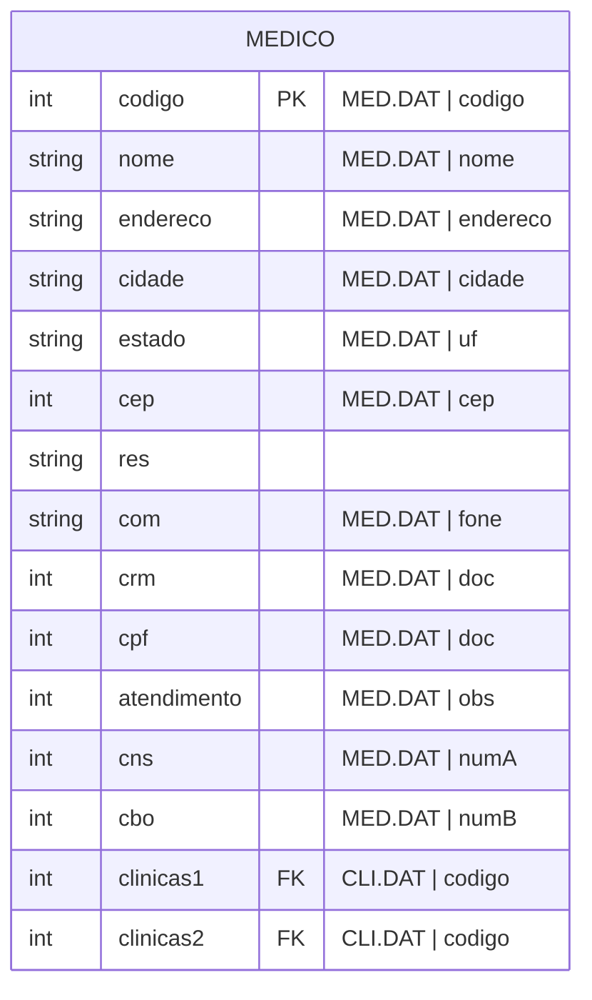

#entidade
## Arquivos:
- MED.DAT
- CLI.DAT ([[Especialidade (CLI.DAT)]])

---

## Entidade:

### Obs:
- `crm` é os 5 primeiros dígitos de `MED.DAT/doc`
- `cpf` é a partir do 6º dígito de `MED.DAT/doc`
