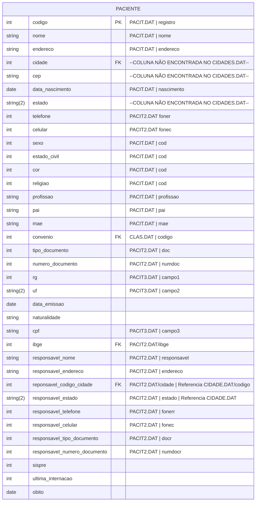

#entidade
## Arquivos:
- PACIT.DAT
- PACIT2.DAT
- PACIT3.DAT
- IBGE.DAT
- CIDADES.DAT
- CLAS.DAT

---

## Entidade:

### Valores predefinidos:
#### sexo
- 1 = Masculino
- 2 = Feminino
#### estado_civil
- 1 = Casado
- 2 = Solteiro
- 3 = Viuvo
- 4 = Menor
- 5 = Separado
- 6 = Divorciado
#### religiao
- 1 = Catolico
- 2 = Evangelico
- 3 = Espirita
- 4 = T. Jeova
- 5 = Outros
#### documento
- 0 = Sem Doc.
- 1 = PIS/PASEP
- 2 = RG
- 3 = Cer. Nasc.
- 4 = CPF
- 5 = N. saude
- 6 = Outros

### Obs:
- `sexo`, `estado_civil`, `cor` e `religiao` estão juntos em `PACIT.DAT/cod`, nessa ordem