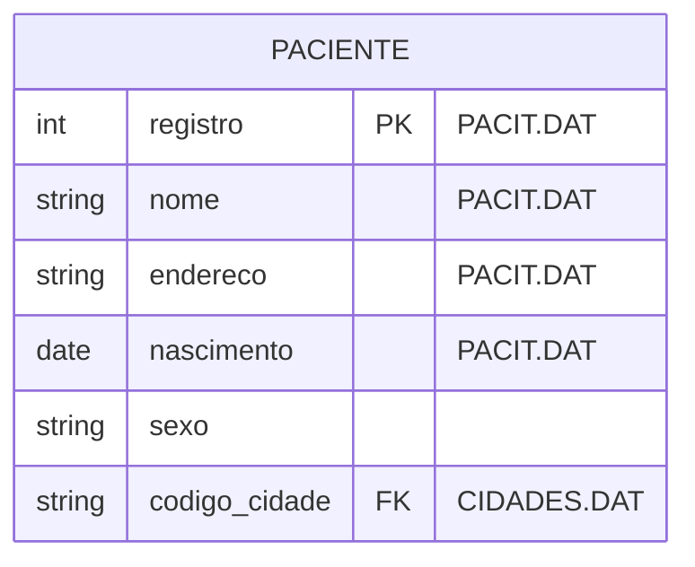

#entidade
## Arquivos:
- PACIT.DAT
- PACIT2.DAT
- PACIT3.DAT
- IBGE.DAT
- CIDADES.DAT
- CLAS.DAT

---

## Entidade:

```mermaid
erDiagram
PACIENTE {
	int registro PK "PACIT.DAT"
	string nome "PACIT.DAT"
	string endereco "PACIT.DAT"
	date nascimento "PACIT.DAT"
	string sexo
	
	string codigo_cidade FK "CIDADES.DAT"
}
```
