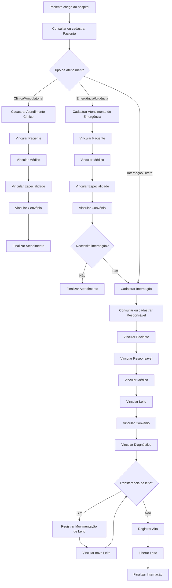

#módulo
## Divisão:
Um sistema hospitalar é dividido entre:
- Atendimento clínico/ambulatorial
- Atendimento de emergência/urgência
- Internação

---

## Requisitos:
O sistema deve:
### Pacientes:
- Cadastrar [[Paciente (PACIT.DAT, PACIT2.DAT, PACIT3.DAT)]]
- Consultar dados do [[Paciente (PACIT.DAT, PACIT2.DAT, PACIT3.DAT)]] cadastrado
- Alterar dados cadastrais de [[Paciente (PACIT.DAT, PACIT2.DAT, PACIT3.DAT)]]
- Vincular [[Paciente (PACIT.DAT, PACIT2.DAT, PACIT3.DAT)]] a [[Internação (INTER.DAT)]]
- Vincular [[Paciente (PACIT.DAT, PACIT2.DAT, PACIT3.DAT)]] a [[Atendimento]]
- Vincular [[Paciente (PACIT.DAT, PACIT2.DAT, PACIT3.DAT)]] a [[Atendimento]]
### Médicos:
- Cadastrar [[Médico (MED.DAT)]]
- Consultar dados do [[Médico (MED.DAT)]] cadastrado
- Alterar dados cadastrais de [[Médico (MED.DAT)]]
- Vincular [[Médico (MED.DAT)]] a [[Internação (INTER.DAT)]]
- Vincular [[Médico (MED.DAT)]] a [[Atendimento]]
- Vincular [[Médico (MED.DAT)]] a [[Atendimento]]
### Especialidades:
- Cadastrar [[Especialidade (CLI.DAT)]]
- Vincular [[Especialidade (CLI.DAT)]] a [[Especialidade do Médico]]
- Vincular [[Especialidade (CLI.DAT)]] a [[Atendimento]]
- Vincular [[Especialidade (CLI.DAT)]] a [[Atendimento]]
### Internações:
- Cadastrar [[Internação (INTER.DAT)]]
- Consultar [[Internação (INTER.DAT)]]
- Transferir [[Internação (INTER.DAT)]] entre [[Leito]]
### Altas:
- Cadastrar [[Alta (ALTA.DAT)]]
- Consultar [[Alta (ALTA.DAT)]]
### Diagnósticos:
- Cadastrar [[Diagnóstico (DIAG.DAT)]]
- Consultar [[Diagnóstico (DIAG.DAT)]]
- Consultar [[Diagnóstico (DIAG.DAT)]] da Tabela CID10
- Vincular [[Diagnóstico (DIAG.DAT)]] a [[Diagnóstico da Internação]]
### Diagnósticos da Internação:
- Cadastrar [[Diagnóstico da Internação]]
- Consultar [[Diagnóstico da Internação]]
- Alterar [[Diagnóstico da Internação]]
- Vincular [[Diagnóstico da Internação]] a [[Internação (INTER.DAT)]]
### Leitos:
- Cadastrar [[Leito]]
- Consultar situação do [[Leito]]
- Bloquear [[Leito]]
- Liberar [[Leito]] após [[Alta (ALTA.DAT)]]
- Vincular [[Leito]] a [[Internação (INTER.DAT)]]
- Vincular [[Leito]] a [[Quarto]]
### Quartos:
- Cadastrar [[Quarto]]
- Vincular [[Quarto]] a [[Setor (SET.DAT)]]
### Setores:
- Cadastrar [[Setor (SET.DAT)]]
- Consultar [[Setor (SET.DAT)]]
### Horários de Atendimento
- Cadastrar [[Horário de Atendimento]]
- Vincular [[Horário de Atendimento]] a [[Médico (MED.DAT)]]
### Atendimento
- Cadastrar [[Atendimento]]
- Consultar [[Atendimento]]
### Convênios:
- Cadastrar [[Convênio]]
- Consultar [[Convênio]]
- Vincular [[Convênio]] a [[Internação (INTER.DAT)]]
- Vincular [[Convênio]] a [[Atendimento]]
- Vincular [[Convênio]] a [[Convênio do Paciente]]
### Responsável
- Cadastrar [[Responsável]]
- Consultar [[Responsável]]
- Alterar dados cadastrais do [[Responsável]]
### Responsáveis do Paciente:
- Cadastrar [[Responsável do Paciente]]
- Consultar [[Responsável do Paciente]]
- Alterar [[Responsável do Paciente]]
- Vincular [[Responsável do Paciente]] a [[Paciente (PACIT.DAT, PACIT2.DAT, PACIT3.DAT)]]
### Movimentação entre Leitos:
- Registrar [[Movimentação de Leito]]
- Consultar [[Movimentação de Leito]]
### Convênios do Paciente:
- Cadastrar [[Convênio do Paciente]]
- Alterar [[Convênio do Paciente]]
- Consultar [[Convênio do Paciente]]
- Vincular [[Convênio do Paciente]] a [[Paciente (PACIT.DAT, PACIT2.DAT, PACIT3.DAT)]]
### Especialidades do Médico:
- Cadastrar [[Especialidade do Médico]]
- Alterar [[Especialidade do Médico]]
- Consultar [[Especialidade do Médico]]
- Vincular [[Especialidade do Médico]] a [[Médico (MED.DAT)]]
### Convênios da Internação:
- Cadastrar [[Convênio da Internação]]
- Vincular [[Convênio da Internação]] a [[Internação (INTER.DAT)]]

---

## Regras de Negócio
### Paciente:
- O CPF do paciente deve ser único
- Um paciente pode possuir múltiplos convênios
- Um paciente pode ter apenas uma internação ativa por vez
- Um paciente pode ter múltiplos atendimentos clínicos e de emergência
### Internação:
- Uma internação deve obrigatoriamente estar vinculada a um paciente
- Uma internação deve estar vinculada a pelo menos um leito durante sua duração
- Uma internação não pode existir sem um convênio associado
- Uma internação só pode ser encerrada mediante alta
- Uma internação não pode ter mais de uma alta registrada
### Responsável:
- Paciente pode ter múltiplos responsáveis
- Responsável pode estar relacionado a múltiplos pacientes
- Responsável precisa ser maior de idade
### Movimentação de Leito:
- Toda ocupação, liberação, ou transferência de leito deve gerar movimentação

---

## Entidades:
- [[Paciente (PACIT.DAT, PACIT2.DAT, PACIT3.DAT)]]
- [[Médico (MED.DAT)]]
- [[Especialidade (CLI.DAT)]]
- [[Diagnóstico (DIAG.DAT)]]
- [[Leito]]
- [[Setor (SET.DAT)]]
- [[Alta (ALTA.DAT)]]
- [[Internação (INTER.DAT)]]
- [[Horário de Atendimento]]
- [[Atendimento]]
- [[Atendimento de Emergência]]
- [[Convênio]]
- [[Tabela CID10]]
- [[Quarto]]
- [[Movimentação de Leito]]
- [[Responsável]]
- [[Convênio do Paciente]]
- [[Especialidade do Médico]]
- [[Convênio da Internação]]
- [[Diagnóstico da Internação]]

---

## Fluxo:
