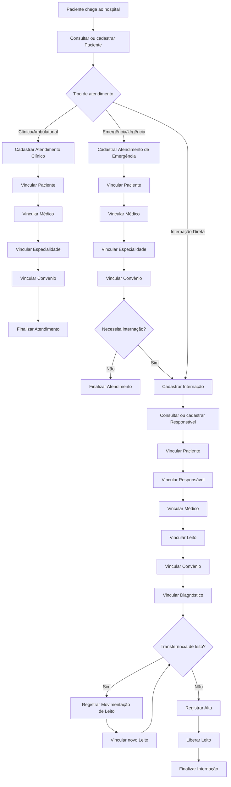

## Divisão:
Um sistema hospitalar é dividido entre:
- Atendimento clínico/ambulatorial
- Atendimento de emergência/urgência
- Internação

---

## Perfis de Usuário:
O sistema é dividido em:

| Usuário       | Responsabilidade                          |
| ------------- | ----------------------------------------- |
| Recepcionista | Cadastro de pacientes, internações, altas |

---

## Requisitos:
O sistema deve:
### Pacientes:
- Cadastrar [[Paciente]]
- Consultar dados do [[Paciente]] cadastrado
- Alterar dados cadastrais de [[Paciente]]
- Vincular [[Paciente]] a [[Internação]]
- Vincular [[Paciente]] a [[Atendimento Clínico]]
- Vincular [[Paciente]] a [[Atendimento de Emergência]]
### Médicos:
- Cadastrar [[Médico]]
- Consultar dados do [[Médico]] cadastrado
- Alterar dados cadastrais de [[Médico]]
- Vincular [[Médico]] a [[Internação]]
- Vincular [[Médico]] a [[Atendimento Clínico]]
- Vincular [[Médico]] a [[Atendimento de Emergência]]
### Especialidades:
- Cadastrar [[Especialidade]]
- Vincular [[Especialidade]] a [[Especialidades do Médico]]
- Vincular [[Especialidade]] a [[Atendimento Clínico]]
- Vincular [[Especialidade]] a [[Atendimento de Emergência]]
### Internações:
- Cadastrar [[Internação]]
- Consultar [[Internação]]
- Transferir [[Internação]] entre [[Leito]]
### Altas:
- Cadastrar [[Alta]]
- Consultar [[Alta]]
### Diagnósticos:
- Cadastrar [[Diagnóstico]]
- Consultar [[Diagnóstico]]
- Consultar [[Diagnóstico]] da [[Tabela CID10]]
- Vincular [[Diagnóstico]] a [[Diagnósticos da Internação]]
### Diagnósticos da Internação:
- Cadastrar [[Diagnósticos da Internação]]
- Consultar [[Diagnósticos da Internação]]
- Alterar [[Diagnósticos da Internação]]
- Vincular [[Diagnósticos da Internação]] a [[Internação]]
### Leitos:
- Cadastrar [[Leito]]
- Consultar situação do [[Leito]]
- Bloquear [[Leito]]
- Liberar [[Leito]] após [[Alta]]
- Vincular [[Leito]] a [[Internação]]
- Vincular [[Leito]] a [[Quarto]]
### Quartos:
- Cadastrar [[Quarto]]
- Vincular [[Quarto]] a [[Setor]]
### Setores:
- Cadastrar [[Setor]]
- Consultar [[Setor]]
### Horários de Atendimento
- Cadastrar [[Horário de Atendimento]]
- Vincular [[Horário de Atendimento]] a [[Médico]]
### Atendimento Clínico/Ambulatorial
- Cadastrar [[Atendimento Clínico]]
- Consultar [[Atendimento Clínico]]
### Atendimento de Emergência/Urgência
- Cadastrar [[Atendimento de Emergência]]
- Consultar [[Atendimento de Emergência]]
### Convênios:
- Cadastrar [[Convênio]]
- Consultar [[Convênio]]
- Vincular [[Convênio]] a [[Internação]]
- Vincular [[Convênio]] a [[Atendimento Clínico]]
- Vincular [[Convênio]] a [[Atendimento de Emergência]]
- Vincular [[Convênio]] a [[Convênios do Paciente]]
### Responsável
- Cadastrar [[Responsável]]
- Consultar [[Responsável]]
- Alterar dados cadastrais do [[Responsável]]
### Responsáveis do Paciente:
- Cadastrar [[Responsáveis do Paciente]]
- Consultar [[Responsáveis do Paciente]]
- Alterar [[Responsáveis do Paciente]]
- Vincular [[Responsáveis do Paciente]] a [[Paciente]]
### Movimentação entre Leitos:
- Registrar [[Movimentação de Leito]]
- Consultar [[Movimentação de Leito]]
### Convênios do Paciente:
- Cadastrar [[Convênios do Paciente]]
- Alterar [[Convênios do Paciente]]
- Consultar [[Convênios do Paciente]]
- Vincular [[Convênios do Paciente]] a [[Paciente]]
### Especialidades do Médico:
- Cadastrar [[Especialidades do Médico]]
- Alterar [[Especialidades do Médico]]
- Consultar [[Especialidades do Médico]]
- Vincular [[Especialidades do Médico]] a [[Médico]]
### Convênios da Internação:
- Cadastrar [[Convênios da Internação]]
- Vincular [[Convênios da Internação]] a [[Internação]]

---

## Regras de Negócio
### Paciente:
- O CPF do paciente deve ser único
- Um paciente pode possuir múltiplos convênios
- Um paciente pode ter apenas uma internação ativa por vez
- Um paciente pode ter múltiplos atendimentos clínicos e de emergência
### Internação:
- Uma internação deve obrigatoriamente estar vinculada a um paciente
- Uma internação deve estar vinculada a pelo menos um leito durante sua duração
- Uma internação não pode existir sem um convênio associado
- Uma internação só pode ser encerrada mediante alta
- Uma internação não pode ter mais de uma alta registrada
### Responsável:
- Paciente pode ter múltiplos responsáveis
- Responsável pode estar relacionado a múltiplos pacientes
- Responsável precisa ser maior de idade
### Movimentação de Leito:
- Toda ocupação, liberação, ou transferência de leito deve gerar movimentação

---

## Entidades:
- [[Paciente]]
- [[Médico]]
- [[Especialidade]]
- [[Diagnóstico]]
- [[Leito]]
- [[Setor]]
- [[Alta]]
- [[Internação]]
- [[Horário de Atendimento]]
- [[Atendimento Clínico]]
- [[Atendimento de Emergência]]
- [[Convênio]]
- [[Tabela CID10]]
- [[Quarto]]
- [[Movimentação de Leito]]
- [[Responsável]]
- [[Convênios do Paciente]]
- [[Especialidades do Médico]]
- [[Convênios da Internação]]
- [[Diagnósticos da Internação]]

---

## Fluxo:
