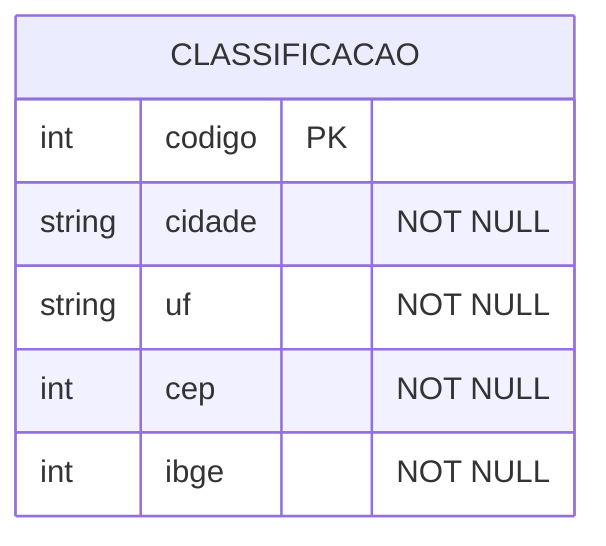

## Descrição:
Usuário pode cadastrar nova classificação ou ver as classificações já cadastradas.

A tela inicia com uma lista de cidades e com os atalhos: [F2](#<kbd>F2</kbd>) e [F4](#<kbd>F4</kbd>).

---

## Campos:
#### Código
- Número
- Obrigatório
#### Cidade
- Texto
#### UF
- Texto
#### CEP Bas.
- Número
#### IBGE
- Número

---

## Entidade:

---

## Atalhos:
#### <kbd>F2</kbd>
- Retorna
#### <kbd>F4</kbd>
- Imprime
#### <kbd>↵</kbd>
- Navegar