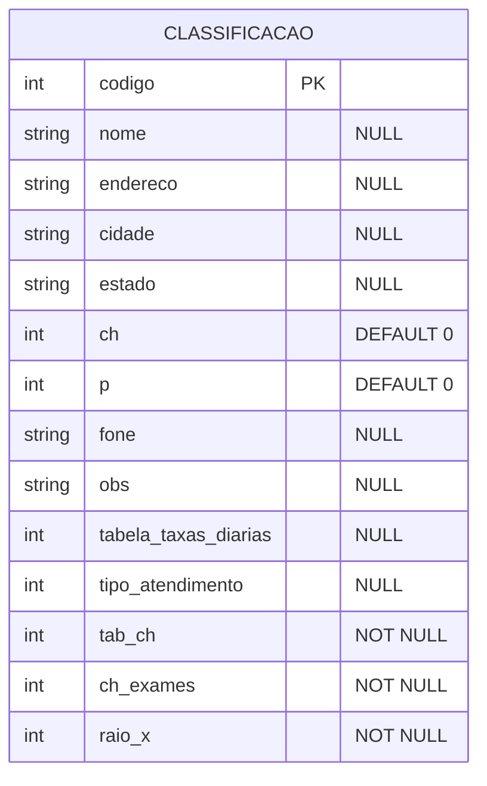

## Descrição:
Usuário pode cadastrar nova classificação ou ver as classificações já cadastradas.

A tela inicia com o formulário em branco e com os atalhos: [↵](#<kbd>↵</kbd>), [F3](#<kbd>F3</kbd>), [F10](#<kbd>F10</kbd>) e [ESC](#<kbd>ESC</kbd>).

Se informar o código de um setor já cadastrados, exibe o registro com os atalhos [F2](#<kbd>F2</kbd>), [F5](#<kbd>F5</kbd>), [F8](#<kbd>F8</kbd>), [↑](#<kbd>↑</kbd>), [↓](#<kbd>↓</kbd>).

Ao apertar [F5](#<kbd>F5</kbd>), os campos se tornam alteráveis e exibe os atalhos [F2](#<kbd>F2</kbd>) e [F4](#<kbd>F4</kbd>).

Se informar o código de um setor não cadastrado, mantém o campo em branco e exibe os atalhos [F2](#<kbd>F2</kbd>), [F3](#<kbd>F3</kbd>), [↑](#<kbd>↑</kbd>) e [↓](#<kbd>↓</kbd>).

---

## Campos:
#### Código
- Número
- Obrigatório
#### Nome
- Texto
#### Endereço
- Número
#### Cidade
- Número
#### Estado
- Texto
#### CH n.
- Número
#### p.
- Número
#### Fone
- Texto
#### Obs.
- Texto
#### Tabela de Taxas e Diárias
- Número
#### Tipo de atendimento
- Número
#### Tab. CH
- Número
#### CH Exames
- Número
#### Raio-X
- Número

---

## Entidade:

---

## Atalhos:
#### <kbd>Esc</kbd>
- Volta ao menu
#### <kbd>F2</kbd>
- Retorna
#### <kbd>F3</kbd>
- Consulta alfabética (tela inicial)
- Cadastrar novo registro (quando código informado não existe)
#### <kbd>F4</kbd>
- Gravar
#### <kbd>F5</kbd>
- Alterar
#### <kbd>F8</kbd>
- Apagar
#### <kbd>F10</kbd>
- Imprimir
#### <kbd>↵</kbd>
- Entre com o registro
#### <kbd>↑</kbd>
- Anterior
#### <kbd>↓</kbd>
- Próximo