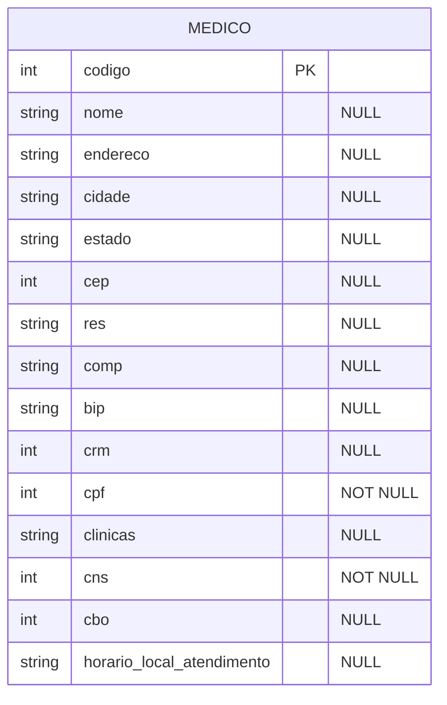
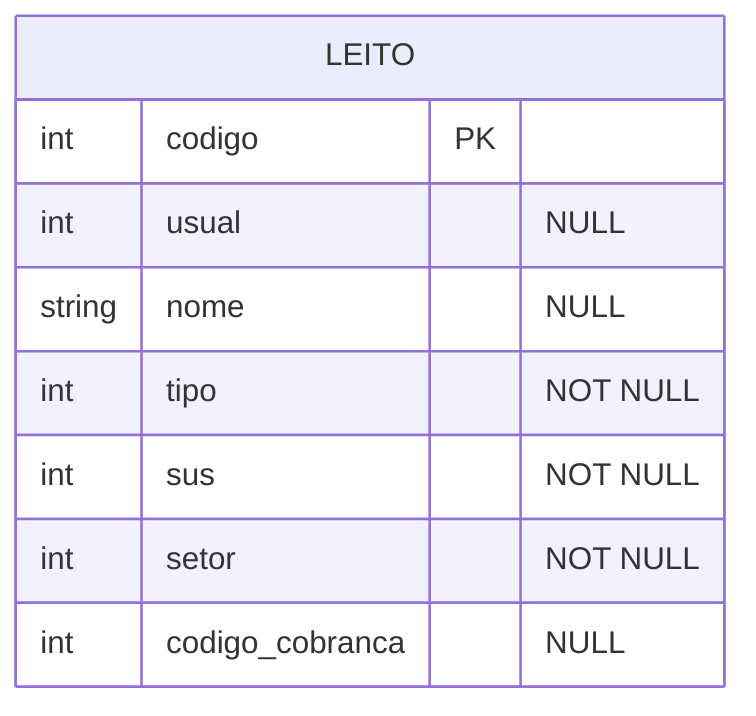
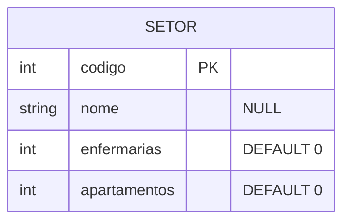

```mermaid
erDiagram
MEDICO {
	int codigo PK
	string nome "NULL"
	string endereco "NULL"
	string cidade "NULL"
	string estado "NULL"
	int cep "NULL"
	string res "NULL"
	string comp "NULL"
	string bip "NULL"
	int crm "NULL"
	int cpf "NOT NULL"
	string clinicas "NULL"
	int cns "NOT NULL"
	int cbo "NULL"
	string horario_local_atendimento "NULL"
}
```

```mermaid
erDiagram
LEITO {
	int codigo PK
	int usual "NULL"
	string nome "NULL"
	int tipo "NOT NULL"
	int sus "NOT NULL"
	int setor "NOT NULL"
	int codigo_cobranca "NULL"
}
```

```mermaid
erDiagram
SETOR {
	int codigo PK
	string nome "NULL"
	int enfermarias "DEFAULT 0"
	int apartamentos "DEFAULT 0"
}
```
