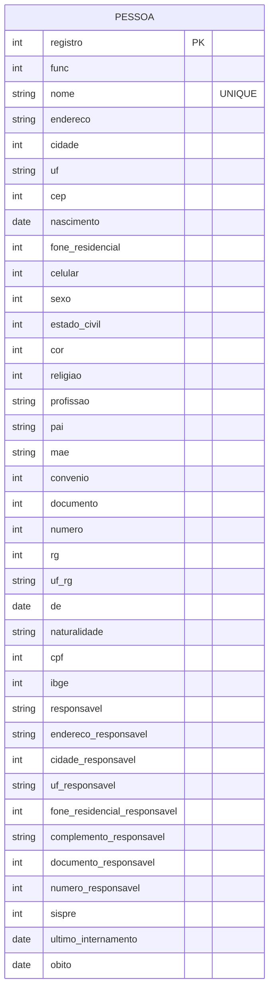

## Descrição:
Usuário pode cadastrar novo leito ou ver os leitos já cadastrados.

A tela inicia com o formulário em branco e com os atalhos: [↵](#<kbd>↵</kbd>), [F3](#<kbd>F3</kbd>), [F10](#<kbd>F10</kbd>) e [ESC](#<kbd>ESC</kbd>).

Se informar o código de um setor já cadastrados, exibe o registro com os atalhos [F2](#<kbd>F2</kbd>), [F5](#<kbd>F5</kbd>), [F8](#<kbd>F8</kbd>), [↑](#<kbd>↑</kbd>), [↓](#<kbd>↓</kbd>).

Ao apertar [F5](#<kbd>F5</kbd>), os campos se tornam alteráveis e exibe os atalhos [F2](#<kbd>F2</kbd>) e [F4](#<kbd>F4</kbd>).

Se informar o código de um setor não cadastrado, mantém o campo em branco e exibe os atalhos [F2](#<kbd>F2</kbd>), [F3](#<kbd>F3</kbd>), [↑](#<kbd>↑</kbd>) e [↓](#<kbd>↓</kbd>).

---

## Campos:
#### Registro
- Número
- Obrigatório
#### Func
#### Nome
- Texto
- Único
#### Endereço
- Texto
#### Cidade
- Número
#### UF
- Texto
#### CEP
- Número
#### Nascimento
- Data
#### Fone residencial
- Número
#### Celular
- Número
#### Sexo
- Número
#### Estado civil
- Número
#### Cor
- Número
#### Religião
- Número
#### Profissão
- Texto
#### Pai
- Texto
#### Mãe
- Texto
#### Convênio
- Número
#### Documento
- Número
#### Número
- Número
#### RG
- Número
#### UF
- Texto
#### De
- Data
#### Naturalidade
- Texto
#### CPF
- Número
#### IBGE
- Número
#### Responsável
- Texto
#### Endereço
- Texto
#### Cidade
- Número
#### UF
- Texto
#### Fone residencial
- Número
#### Complemento
- Texto
#### Documento
- Número
#### Número
- Número
#### Sispre
- Número
#### Último Internamento
- Data
##### Óbito
- Data
---

## Entidade:

---

## Atalhos:
#### <kbd>Esc</kbd>
- Volta ao menu
#### <kbd>F2</kbd>
- Retorna
#### <kbd>F3</kbd>
- Incluir (tela inicial)
#### <kbd>F4</kbd>
- Fonética (tela inicial)
- Gravar (na tela de alteração do registro)
#### <kbd>F5</kbd>
- Alfabética (tela inicial)
- Alterar (quando código informado existe)
#### <kbd>F8</kbd>
- Apagar
#### <kbd>F10</kbd>
- Imprimir ficha
#### <kbd>↵</kbd>
- Entre com o registro
#### <kbd>↑</kbd>
- Anterior
#### <kbd>↓</kbd>
- Próximo