# Relacionamento de Entidades do Sistema Legado

Este diagrama consolida as entidades mapeadas a partir dos arquivos `.DAT` das pastas de módulos (Estoque, Financeiro e Recepção), incluindo as colunas de origem de cada campo.

```mermaid
erDiagram
    %% =======================
    %% MÓDULO ESTOQUE
    %% =======================
    CONSUMIDOR {
        int codigo PK
        string nome
        int tipo
        int sus
        int setor FK "SET.DAT | codigo"
        int paciente FK "PACIT.DAT | registro"
    }
    FORNECEDOR {
        int codigo PK "FORN.DAT | codigo"
        string nome "FORN.DAT | nome"
        string endereco "FORN.DAT | endereco"
        string cidade "FORN.DAT | cidade"
        string estado "FORN.DAT | uf"
        string cep "FORN.DAT | cep"
        string telefone "FORN.DAT | fone"
        string observacao "FORN.DAT | obs"
    }
    GRUPO {
        int codigo PK "GRUP.DAT | codigo"
        string nome "GRUP.DAT | nome"
    }
    PRODUTO {
        int codigo PK "PROD.DAT | codigo"
        string nome "PROD.DAT | nome"
        string unidade "PROD.DAT | unidade"
        string observacao "PROD.DAT | observacao"
        int padrao "PROD.DAT | padrao"
        int minimo "PROD.DAT | minimo"
        int maximo "PROD.DAT | maximo"
        decimal quantidade "PROD.DAT | quantidade"
        int custo_medio "PROD.DAT | medio"
        int grupo FK "GRUP.DAT | codigo"
        int subgrupo FK "SUBGRUP.DAT | codigo"
        int controlado "PROD.DAT | controlado"
        int tabela_compras "PROD.DAT | tipo_compra"
        int ultimo_fornecedor FK "FORN.DAT | codigo"
        date ultima_compra "PROD.DAT | ultdata"
        decimal custo_medio "--CAMPO NÃO ENCONTRADO--"
        decimal proeps "PROD.DAT | unitario"
        decilam brasindice "PROD.DAT | pbrasindice"
        decimal reposicao "--CAMPO NÃO ENCONTRADO--"
    }
    SUBGRUPO {
        int codigo_grupo FK "GRUP.DAT | codigo"
        int codigo PK "SUBGRUP.DAT | campo1"
        string nome "SUBGRUP.DAT | campo2"
    }

    %% =======================
    %% MÓDULO FINANCEIRO
    %% =======================
    TAXA_DIARIA {
        int codigo PK "TXDIARIA.DAT | campo1"
        string descricao "TXDIARIA.DAT | campo2"
        int tipo "TXDIARIA.DAT | tipo"
        decimal valor_sanepar "TXDIARIA.DAT | valor1"
        decimal valor_copel "TXDIARIA.DAT | valor2"
        decimal valor_ipe "TXDIARIA.DAT | valor3"
        decimal valor_unimed "TXDIARIA.DAT | valor4"
        decimal valor_bradesco "TXDIARIA.DAT | valor5"
        decimal em_branco "TXDIARIA.DAT | valor6"
        decimal valor_furnas "TXDIARIA.DAT | valor7"
        decimal valor_coamo "TXDIARIA.DAT | valor8"
        decimal valor_pam "TXDIARIA.DAT | valor9"
        decimal valor_sas "TXDIARIA.DAT | valor10"
    }
    EXAME {
        int codigo PK
        int codigo_amb
        string nome
        int tipo_exame
        int ch_90
        int ch_92
        int ch_96
        decimal filme
        decimal valor_sus
        decimal particular
        decimal convenio
    }
    FATURA {
        int codigo PK
        int data_entrada
        int data_saida
    }
    VALOR_CH {
        int mes_ano PK
        decimal valor_moeda
        decimal valor_ch0
        decimal valor_ch1
        decimal valor_ch2
        decimal valor_ch3
        decimal valor_ch4
        decimal valor_ch5
        decimal valor_ch6
        decimal valor_ch7
        decimal valor_ch8
        decimal valor_ch9
        decimal valor_sadt
        decimal valor_livre
        int dia1
        int dia2
        int dia3
        int dia4
        int dia5
        string descricao_dia1
        string descricao_dia2
        string descricao_dia3
        string descricao_dia4
        string descricao_dia5
    }

    %% =======================
    %% MÓDULO RECEPÇÃO
    %% =======================
    ALTA {
        int codigo PK "PACIT.DAT | codigo"
        int paciente FK "PACIT.DAT | codigo"
        date data_entrada "PACIT.DAT | dentrada"
        date data_alta "PACIT.DAT | dalta"
        int tipo_alta "PACIT.DAT | talta"
        int hora
        int setor FK "SET.DAT | codigo"
        int quarto FK "CONSU.DAT | codigo"
        int encaminhamento
        int classificacao FK "CLAS.DAT | codigo"
        int diagnostico FK "DIAG.DAT | codigo"
    }
    CIDADE {
        int codigo PK
        string cidade
        string uf
        string cep
        string ibge
    }
    CLASSIFICACAO {
        int codigo PK "CLAS.DAT | codigo"
        string nome "CLAS.DAT | nome"
        string endereco "CLAS.DAT | nome"
        string cidade "CLAS.DAT | cidade"
        string estado "CLAS.DAT | uf"
        int tabela_taxas_diarias "CLAS.DAT | cod2"
        int tipo_atendimento "CLAS.DAT | tipo"
        int tabela_ch "CLAS.DAT | cod1"
        int ch_exames "CLAS.DAT | tipo"
        int raio_x "CLAS.DAT | tipo"
    }
    DIAGNOSTICO {
        int codigo PK "DIAG.DAT | codigo"
        string nome ""
        int cid "DIAG.DAT | num2"
        int ssm "DIAG.DAT | codSus"
        int amb "DIAG.DAT | num1"
        int qtd_ch "DIAG.DAT | num3"
        int porte "DIAG.DAT | num3"
        int auxiliares "DIAG.DAT | num3"
    }
    ESPECIALIDADE {
        int codigo PK "CLI.DAT | codigo"
        string nome "CLI.DAT | nome"
    }
    INTERNACAO {
        int codigo PK "INTER.DAT | codigo"
        int paciente FK "PACIT.DAT | registro"
        string responsavel FK "PACIT.DAT | responsavel"
        int data_entrada "INTER.DAT | dentrada"
        int horas "INTER.DAT | horas"
        int encaminhamento "INTER.DAT | encaminhamento"
        int classificacao FK "CLAS.DAT | codigo"
        int diagnostico FK "DIAG.DAT | codigo"
        int clinica FK "CLI.DAT | codigo"
        int medico FK "MED.DAT | codigo"
        int leito FK "CONSU.DAT | codigo"
        int tem_guia "CONSU.DAT | temguia"
    }
    MEDICO {
        int codigo PK "MED.DAT | codigo"
        string nome "MED.DAT | nome"
        string endereco "MED.DAT | endereco"
        string cidade "MED.DAT | cidade"
        string estado "MED.DAT | uf"
        int cep "MED.DAT | cep"
        string res "--BRUNO FALOU QUE NÃO USA--"
        string com "MED.DAT | fone"
        int crm "MED.DAT | doc"
        int cpf "MED.DAT | doc"
        int atendimento "MED.DAT | obs"
        int cns "MED.DAT | numA"
        int cbo "MED.DAT | numB"
        int clinicas1 FK "CLI.DAT | codigo"
        int clinicas2 FK "CLI.DAT | codigo"
    }
    PACIENTE {
        int codigo PK "PACIT.DAT | registro"
        string nome "PACIT.DAT | nome"
        string endereco "PACIT.DAT | endereco"
        string cidade "PACIT.DAT | cidade"
        string estado "PACIT.DAT | uf"
    }
    SETOR {
        int codigo PK "SET.DAT | codigo"
        string nome "SET.DAT | nome"
        int enfermarias ""
        int apartamentos
    }

    %% =======================
    %% RELACIONAMENTOS (FKs)
    %% =======================
    CONSUMIDOR }|--|| SETOR : pertence_ao
    CONSUMIDOR }o--|| PACIENTE : pertence_ao
    
    PRODUTO }|--|| GRUPO : pertence_ao
    PRODUTO }o--|| SUBGRUPO : pertence_ao
    PRODUTO }o--|| FORNECEDOR : ultimo_fornecedor
    SUBGRUPO }|--|| GRUPO : pertence_ao
    
    ALTA }o--|| PACIENTE : referente_ao
    ALTA }o--|| SETOR : ocorreu_no
    ALTA }o--|| CONSUMIDOR : quarto
    ALTA }o--|| CLASSIFICACAO : classificado_como
    ALTA }o--|| DIAGNOSTICO : diagnosticado_como
    
    INTERNACAO }o--|| PACIENTE : referente_ao
    INTERNACAO }o--|| PACIENTE : responsavel
    INTERNACAO }o--|| CLASSIFICACAO : classificado_como
    INTERNACAO }o--|| DIAGNOSTICO : diagnosticado_como
    INTERNACAO }o--|| ESPECIALIDADE : clinica
    INTERNACAO }o--|| MEDICO : atendido_por
    INTERNACAO }o--|| CONSUMIDOR : leito
    
    MEDICO }o--|| ESPECIALIDADE : possui_especialidade_1
    MEDICO }o--|| ESPECIALIDADE : possui_especialidade_2
```

