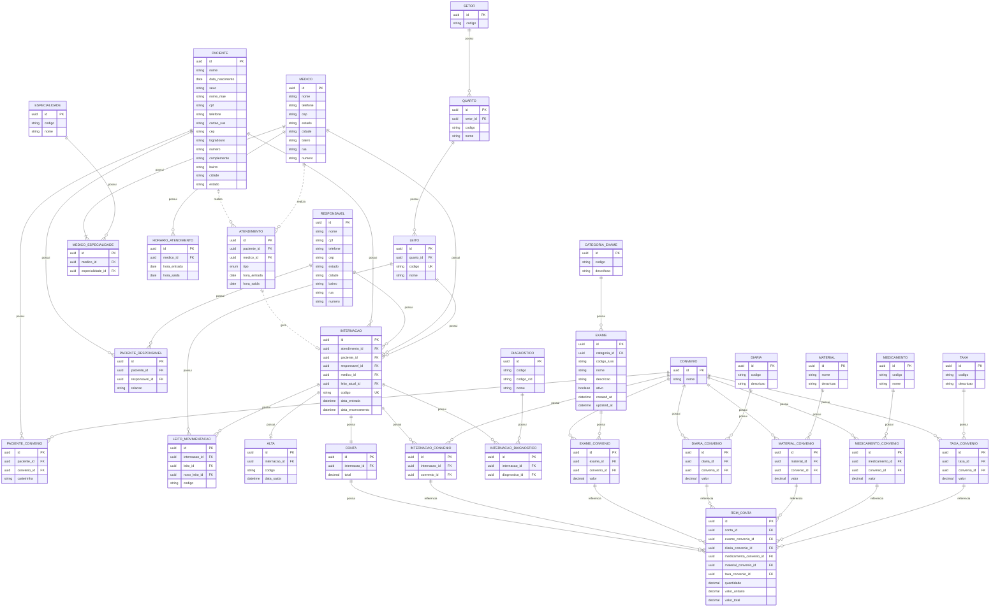

```mermaid
erDiagram

  

ATENDIMENTO ||..o| INTERNACAO : gera

  

PACIENTE ||..o{ ATENDIMENTO : realiza

PACIENTE ||--o{ INTERNACAO : possui

PACIENTE ||--o{ PACIENTE_CONVENIO : possui

PACIENTE ||--o{ PACIENTE_RESPONSAVEL : possui

  

RESPONSAVEL ||--o{ PACIENTE_RESPONSAVEL : possui

RESPONSAVEL ||--o{ INTERNACAO : possui

  

MEDICO ||..o{ ATENDIMENTO : realiza

MEDICO ||--o{ INTERNACAO : possui

MEDICO ||--|{ MEDICO_ESPECIALIDADE : possui

MEDICO ||--o{ HORARIO_ATENDIMENTO : possui

  

ESPECIALIDADE ||--o{ MEDICO_ESPECIALIDADE : possui

  

SETOR ||--o{ QUARTO : possui

  

QUARTO ||--o{ LEITO : possui

  

LEITO ||--o{ LEITO_MOVIMENTACAO : possui

LEITO ||--o{ INTERNACAO : possui

  

INTERNACAO ||--o| ALTA : possui

INTERNACAO ||--|| CONTA : possui

INTERNACAO ||--o{ INTERNACAO_CONVENIO : possui

INTERNACAO ||--o{ INTERNACAO_DIAGNOSTICO : possui

INTERNACAO ||--o{ LEITO_MOVIMENTACAO : possui

  

CONVENIO ||--o{ PACIENTE_CONVENIO : possui

CONVENIO ||--o{ INTERNACAO_CONVENIO : possui

CONVENIO ||--o{ TAXA_CONVENIO : possui

CONVENIO ||--o{ EXAME_CONVENIO : possui

CONVENIO ||--o{ MATERIAL_CONVENIO : possui

CONVENIO ||--o{ MEDICAMENTO_CONVENIO : possui

CONVENIO ||--o{ DIARIA_CONVENIO : possui

  

MATERIAL ||--o{ MATERIAL_CONVENIO : possui

  

DIARIA ||--o{ DIARIA_CONVENIO : possui

  

MEDICAMENTO ||--o{ MEDICAMENTO_CONVENIO : possui

  

DIAGNOSTICO ||--o{ INTERNACAO_DIAGNOSTICO : possui

  

EXAME ||--o{ EXAME_CONVENIO : possui

  

CATEGORIA_EXAME ||--o{ EXAME : possui

  

TAXA ||--o{ TAXA_CONVENIO : possui

  

CONTA ||--o{ ITEM_CONTA : possui

  

INTERNACAO_CONVENIO ||--o{ ITEM_CONTA : referencia

  

EXAME_CONVENIO ||--o{ ITEM_CONTA : referencia

  

DIARIA_CONVENIO ||--o{ ITEM_CONTA : referencia

  

MATERIAL_CONVENIO ||--o{ ITEM_CONTA : referencia

  

MEDICAMENTO_CONVENIO ||--o{ ITEM_CONTA : referencia

  

TAXA_CONVENIO ||--o{ ITEM_CONTA : referencia

  

TAXA_CONVENIO {

  uuid id PK

  uuid taxa_id FK

  uuid convenio_id FK

  decimal valor

}

  

TAXA {

  uuid id PK

  string codigo

  string descricao

}

  

MEDICAMENTO_CONVENIO {

  uuid id PK

  uuid medicamento_id FK

  uuid convenio_id FK

  decimal valor

}

  

MEDICAMENTO {

  uuid id PK

  string codigo

  string nome

}

  

MATERIAL_CONVENIO {

  uuid id PK

  uuid material_id FK

  uuid convenio_id FK

  decimal valor

}

  

MATERIAL {

  uuid id PK

  string nome

  string descricao

}

  

ITEM_CONTA {

  uuid id PK

  uuid conta_id FK

  uuid exame_convenio_id FK

  uuid diaria_convenio_id FK

  uuid medicamento_convenio_id FK

  uuid material_convenio_id FK

  uuid taxa_convenio_id FK

  decimal quantidade

  decimal valor_unitario

  decimal valor_total

}

  

EXAME_CONVENIO {

  uuid id PK

  uuid exame_id FK

  uuid convenio_id FK

  decimal valor

}

  

EXAME {

  uuid id PK

  uuid categoria_id FK

  string codigo_tuss

  string nome

  string descricao

  boolean ativo

  datetime created_at

  datetime updated_at

}

  

DIARIA_CONVENIO {

  uuid id PK

  uuid diaria_id FK

  uuid convenio_id FK

  decimal valor

}

  

DIARIA {

  uuid id PK

  string codigo

  string descricao

}

  

CONTA {

  uuid id PK

  uuid internacao_id FK

  decimal total

}

  

CATEGORIA_EXAME {

  uuid id PK

  string codigo

  string descrifcao

}

  

ALTA {

  uuid id PK

  uuid internacao_id FK

  string codigo

  datetime data_saida

}

  

ATENDIMENTO {

  uuid id PK

  uuid paciente_id FK

  uuid medico_id FK

  enum tipo

  date hora_entrada

  date hora_saida

}

  

CONVENIO {

  uuid id PK

  string nome

}

  

INTERNACAO_CONVENIO {

  uuid id PK

  uuid internacao_id FK

  uuid convenio_id FK

}

  

PACIENTE_CONVENIO {

  uuid id PK

  uuid paciente_id FK

  uuid convenio_id FK

  string carteirinha

}

  

DIAGNOSTICO {

  uuid id PK

  string codigo

  string codigo_cid

  string nome

}

  

INTERNACAO_DIAGNOSTICO {

  uuid id PK

  uuid internacao_id FK

  uuid diagnostico_id FK

}

  

ESPECIALIDADE {

  uuid id PK

  string codigo

  string nome

}

  

MEDICO_ESPECIALIDADE {

  uuid id PK

  uuid medico_id FK

  uuid especialidade_id FK

}

  

HORARIO_ATENDIMENTO {

  uuid id PK

  uuid medico_id FK

  date hora_entrada

  date hora_saida

}

  

INTERNACAO {

  uuid id PK

  uuid atendimento_id FK

  uuid paciente_id FK

  uuid responsavel_id FK

  uuid medico_id FK

  uuid leito_atual_id FK

  string codigo UK

  datetime data_entrada

  datetime data_encerramento

}

  

LEITO {

  uuid id PK

  uuid quarto_id FK

  string codigo UK

  string nome

}

  

MEDICO {

  uuid id PK

  string nome

  string telefone

  string cep

  string estado

  string cidade

  string bairro

  string rua

  string numero

}

  

LEITO_MOVIMENTACAO {

  uuid id PK

  uuid internacao_id FK

  uuid leito_id FK

  uuid novo_leito_id FK

  string codigo

}

  

PACIENTE {

  uuid id PK

  string nome

  date data_nascimento

  string sexo

  string nome_mae

  string cpf

  string telefone

  string cartao_sus

  string cep

  string logradouro

  string numero

  string complemento

  string bairro

  string cidade

  string estado

}

  

QUARTO {

  uuid id PK

  uuid setor_id FK

  string codigo

  string nome

}

  
  

RESPONSAVEL {

  uuid id PK

  string nome

  string cpf

  string telefone

  string cep

  string estado

  string cidade

  string bairro

  string rua

  string numero

}

  

PACIENTE_RESPONSAVEL {

  uuid id PK

  uuid paciente_id FK

  uuid responsavel_id FK

  string relacao

}

  

SETOR {

  uuid id PK

  string codigo

}
```
